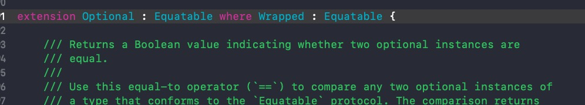

### swift 中实现多态的方式

1. 子类型和方法重写：根据类型的不同，同样的方法呈现不同的行为

2. 函数重载：为类型多次写统一个函数(参数类型不同)的行为；

3. 通过泛型来实现


> 补充：swift 中一个完整的函数包括函数的基本名(括号前面的部分)，也包括他的参数标签；如 集合类型的 `index(_:offsetBy:)`，该函数接手两个参数(由冒号表示)

> 函数也是引用类型

### 可选值

#### 1. 隐式转换为可选值

Swift 会在类型推断为Operation时将你所写的类型T，隐式转换为 Operation<T> (T?)类型,如下

```
let a: [Int?] = [1, 2, nil]
print("a = \(a)")
// a = [Optional(1), Optional(2), nil]

// 或者

let a = [1, 2, nil]
print("a = \(a)")
// a = [Optional(1), Optional(2), nil]

```

> ❌  可选值并没有遵守 Equatable 协议 ❌ Swift 4.2 及以后版本中 已经实现了 Equatable 协议




### 结构体

**结构体是值类型但他们不一定都是存储在栈上的**

```
class MyClass {}

var cls = MyClass()

func counterFunc() -> (Int) -> String {
    var counter = 0
    return {i in
        print("cls    : \(Unmanaged.passUnretained(cls).toOpaque())")
        var i2 = i
        Swift.withUnsafePointer(to: &i2) { print("i2     : \($0)") }
        counter += i
        Swift.withUnsafePointer(to: &cls) { print("counter: \($0)") }
        return "running total:\(counter)"
    }
}

f(3)//running total:3
f(4)//running total:7
f(-1)
f(-3)

```

打印结果：

```
cls    : 0x0000600001ba43c0
i2     : 0x00007ffeeed48be0
counter: 0x0000000117526770
cls    : 0x0000600001ba43c0
i2     : 0x00007ffeeed48be0
counter: 0x0000000117526770
cls    : 0x0000600001ba43c0
i2     : 0x00007ffeeed48be0
counter: 0x0000000117526770
cls    : 0x0000600001ba43c0
i2     : 0x00007ffeeed48be0
counter: 0x0000000117526770
```

```
/*
 1. 闭包 = 函数\闭包表达式 + 捕获变量
 2. 函数\表达式 也是引用类型
 思考:
    1. 为什么 i2 的地址会不会变动
    2. counter 存储在栈上吗？
 */
```

> ??? counter 将存在于堆上而非栈上 ???。我们可以多次调用 counterFunc，并且看到 running total 的输出在增加：
 
> Swift 的结构体一般被存储在栈上，不过可变结构体默认是存储在堆上的，但大多数情况下这些可变结构体都会被编译器优化并存储到栈上。当编译器侦测到结构体变量被一个函数闭合的时候这种优化将不再生效，此时可变结构体存储在堆上!

**因为闭包 (也包括内部函数) 通过引用的方式来捕获变量**

> 上面例子中：counter 在退出 counterFun 的作用域时任然存在！(因为被逃逸闭包捕获的变量需要在栈帧之外依然存在!)


`Swift` 的 `copy-in` `copy-out` 模型，`引用调用`优化，官方文档如下：
 
  > As an optimization, when the argument is a value stored at a physical address in memory, the same memory location is used both inside and outside the function body. The optimized behavior is known as call by reference; it satisfies all of the requirements of the copy-in copy-out model while removing the overhead of copying. Write your code using the model given by copy-in copy-out, without depending on the call-by-reference optimization, so that it behaves correctly with or without the optimization.
 
`Swift` 中开发者没办法知道和干预何时会发生结构体的复制，这些简化给了编译器更多的可能性，来排除那些不必要的复制，或者使用触底引用而非值的方式来优化一个常量结构体  -- `Swift进阶>结构体和类>值类型`
 
编译器所做的对于值**类型**的_复制优化_和值**语义**类型的_写时复制_行为并不是一回事。_写时复制_需要开发者来实现  -- `Swift进阶>结构体和类>值类型`


### 类

> === 用来判断两个变量是否引用同一个对象,用于引用的判断


### 函数


**闭包 = 闭包表达式 + 捕获变量**

**函数也是引用类型**

**闭包 (也包括内部函数) 通过引用的方式来捕获变量。**

> 在底层，实例方法会被处理为这样一个函数：如果给定某个实例，它将返回另一个可以在该实例上进行操作的函数。
> cls.printFunc 实际上只是 MyClass.printFunc(cls) 的另一种写法
> 两种表达式返回的都是类型为 (Int) -> () 的函数，这个函数强引用了 cls 实例.


#### inout 参数

**一. inout 参数虽然使用&，但这并不是传递引用(区别于c和c++)：**

> 官方文档: inout 参数将一个值传递给函数，函数可以改变这个值，然后将原来的值替换掉，并从函数中传出。

> 编译器 **可能** 会把 `inout` 变量优化为引用传递，而非传入和传出时的复制。但，文档已经明确指出我们不应该依赖 `inout` 的这个行为。


**二. 嵌套函数和 inout**

你可以在嵌套函数中使用 `inout` 参数， `Swift` 依然会保证你的使用是安全的。

但是 `inout` 参数不能参与逃逸

```
func escapeIncrement(value: inout Int) -> () -> () {
    func inc() {
        value += 1
    }
    return inc// Nested function cannot capture inout parameter and escape
}
```

**三. & 不意味着 inout 的情况**


#### 计算属性


**短路求值** : 如 `表达式A && 表达式B` , 如果 `表达式A` 为 `false` 则 `表达式B` 将不再进行求值的操作；

短路求值的例子

```Swift
let evens = [2, 4, 6]

if !evens.isEmpty && evens[0] > 10 {
    print("xxx")
}
// 或者
if let first = evens.first, first > 10 {
    print("yyy")
}

```


#### @escaping

> 一个被保存在某个地方等待稍候(比如函数返回后)在调用的闭包就叫做 **逃逸闭包**

**闭包默认是非逃避的，所以你想要保存一个闭包就需要在参数标记为 `@escaping` **

编译器会对参数形式的闭包进行验证，如果你的闭包没有被标记为 `@escaping` ，编译器将不允许你保存这个闭包(或者将他返回给调用者!)


### 四. 字符串

> 寻找 `Character` 边界起始位置的可靠方法是使用 Foundation 中的 `rangeOfComposedCharacterSequenc:` 方法

```
extension String.Index {
    func samePositionOnCharacterBoundary(in str: String) -> String.Index {
        let  range = str.rangeOfComposedCharacterSequence(at: self)
        return range.lowerBound
    }
}

let family = "👨‍👩‍👧‍👦"

let noCharacterBoundary = family.utf16.index(family.utf16.startIndex, offsetBy: 3)
// 在字符视图中，并非有效的位置
noCharacterBoundary.utf16Offset(in: family)//3
noCharacterBoundary < family.utf16.endIndex// true
if let idx = String.Index(noCharacterBoundary, within: family) {
    family[idx]
} else {
	 print("Error! No such index!")// Error! No such index!
}
// 有效位置
let validIndex = noCharacterBoundary.samePositionOnCharacterBoundary(in: family)
family[validIndex]// 👨‍👩‍👧‍👦

```

### 泛型

`distance(from:to:)`方法的复杂度问题

**`RandomAccessCollection` 类型的集合 `distance` 的操作复杂度为 O(1)**

```
extension String {
    func tests() -> Int {
        let start = startIndex
        let end = endIndex
        // 由于 String 不是 RandomAccessCollection 类型，
        // 因此 distance 的复杂度为 O(n)，n 为 from 到 end 的间距
        let result = distance(from: start, to: end)
        return result
    }
}

"1234".tests()
"👨‍🚒爱👮‍♀️".tests()
"👨‍🚒爱👮‍♀️".count

```

**通过协议进行代码共享比继承的优势**

* 我们不需要被强制使用某个父类
* 我们可以让已存在的类型满足协议。子类无法追溯的方式去改变他的父类
* 协议既可以用于类也可以用于结构体
* 当处理协议时，我们无需但系方法重写或者在正确的事件调用 super 这样的问题


### 杂记

1. Swift API 指南推荐你对所有复杂度不是 O(1) 的计算属性都应该在文档中写明，因为调用者可能会假设一个计算属性的耗时是常数时间。

2. `Sequenc` 协议中的 `contains()`方法在数组中的时间复杂度为 `O(n)`，在 `set` 中的复杂度为 `O(1)`

3. s


